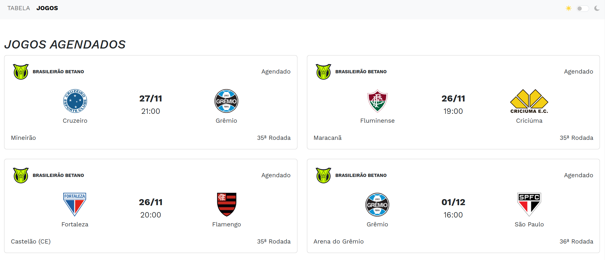

# **Brasilerão Série A Table**

This is a project developed in **Ruby on Rails** using **PostgreSQL** as the database and **Bootstrap** for styling, consuming the [API Futebol](https://dashboard.api-futebol.com.br/).




---

## **Prerequisites**

Before starting, make sure you have the following installed on your machine:

- **Ruby** (minimum version: 3.x)
- **Rails** (minimum version: 7.x)
- **PostgreSQL**
- **Bundler** (dependency management gem)

---

## **Initial Setup**

1. **Clone the repository**:
   ```
   git clone https://github.com/zambiazzi/tabela-brasileirao.git
   cd project-name
    ```
   
2. **Install dependencies:**  

   `Bundle install`

3. **Set up the database:**

    `rails db:create db:migrate`
    
4. **Environment variable configuration: Add your API Key in the config/application.yml file:**
    
    `API_KEY: "your-key-here"`

## **Running the Project**

**Start the Rails server:**

`rails server`

**Access the project in your browser:**

`http://localhost:3000`

## **Important Notes**
- The project requires a valid API Key to work. Make sure to configure it in the config/application.yml file.
- Due to the daily limit of 100 requests imposed by the API, the project may experience delays in updates as the application needs to carefully distribute requests throughout the day.
