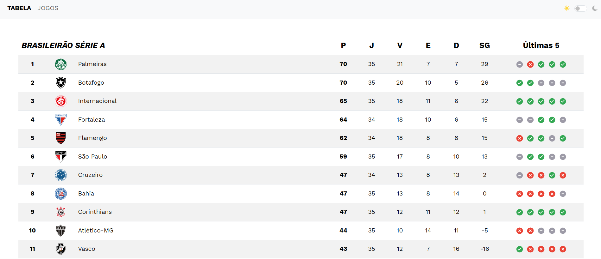
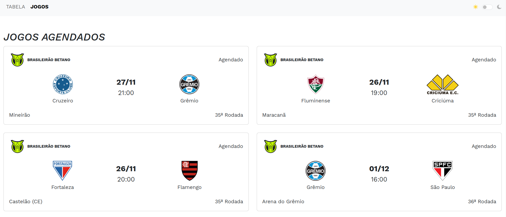

# **Tabela Brasilerão Série A**

Este é um projeto desenvolvido em **Ruby on Rails** utilizando **PostgreSQL** como banco de dados e **Bootstrap** para estilização consumindo a [API Futebol]('https://dashboard.api-futebol.com.br/'). 




---

## **Pré-requisitos**

Antes de começar, você precisa ter instalado em sua máquina:

- **Ruby** (versão mínima: 3.x)
- **Rails** (versão mínima: 7.x)
- **PostgreSQL**
- **Bundler** (gem de gerenciamento de dependências)

---

## **Configuração Inicial**

1. **Clone o repositório**:
   ```
   git clone https://github.com/zambiazzi/tabela-brasileirao.git
   cd nome-do-projeto
    ```
   
2. **Instale as dependências:**  

   `Bundle install`

3. **Configure o banco de dados:**

    `rails db:create db:migrate`
    
4. **Configuração de variáveis de ambiente**
    
    `API_KEY: "sua-chave-aqui"`

## **Rodando o Projeto**

**Inicie o servidor Rails:**

`rails server`

**Acesse o projeto no navegador:**

`http://localhost:3000`

## **Notas Importantes**
- O projeto requer uma API Key válida para funcionamento. Certifique-se de configurá-la no arquivo config/application.yml.
- Devido ao limite diário de 100 requisições imposto pela API, o projeto pode apresentar atrasos nas atualizações, já que a aplicação precisa distribuir cuidadosamente as requisições ao longo do dia.
